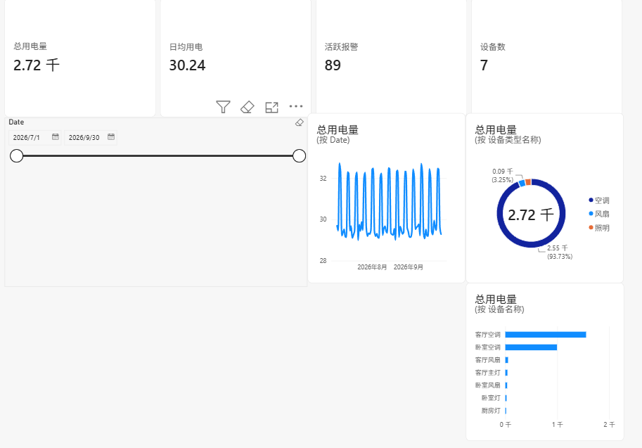
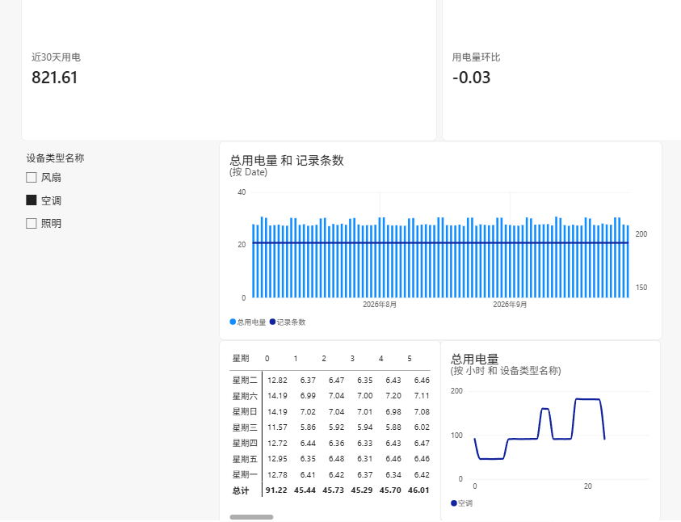
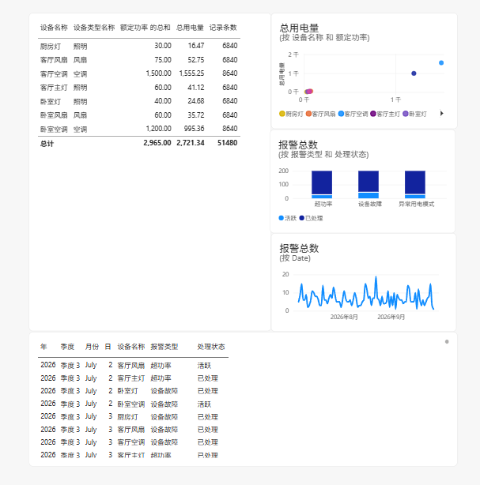

# 智能家居管理系统

基于 Node-RED + MySQL 实现的智能家居控制与用电量统计系统，覆盖设备控制、实时用电监测、历史用电量多维度统计与可视化报表。

## 功能

| 模块 | 功能 | 说明 |
| --- | --- | --- |
| 控制 | 单点控制 | 对单一设备单独开关 |
| 控制 | 批量控制 | 对多台设备批量开关 |
| 监测 | 实时电量监测 | 对设备用电量实时监测 |
| 统计 | 小时 / 日 / 周 / 月统计 | 按四个时间维度统计设备用电量 |

性能要求：单点控制响应 ≤ 0.5 秒，批量控制响应 ≤ 1 秒。

## 数据库设计

数据库名 `smart_home`，共 **7 张表**：

| 表名 | 用途 |
| --- | --- |
| `devices` | 设备表，含设备类型（light / fan / ac）、额定功率、开关状态 |
| `power_consumption` | 实时用电记录表，按设备与时间戳记录用电量 |
| `hourly_stats` | 小时用电统计表 |
| `daily_stats` | 日用电统计表 |
| `weekly_stats` | 周用电统计表（含周序号） |
| `monthly_stats` | 月用电统计表（含月序号） |
| `alerts` | 报警记录表，支持高位用电、设备故障、异常模式三类报警 |

**四张统计表结构一致**，每张按「设备 + 时间粒度」输出 **5 类统计量**：

- `total_power` 总量
- `avg_power` 均值
- `max_power` 最大值
- `min_power` 最小值
- `record_count` 记录数

每张统计表都建了 `(device_id, 时间字段)` 的唯一键，保证同一设备同一时间窗口只生成一条统计记录。

### 存储过程与触发器

- **存储过程 `GenerateSimulatedData()`**：遍历设备表，按设备状态与额定功率计算用电量并批量写入 `power_consumption`，用于生成模拟数据。
- **触发器 `after_device_update`**：监听 `devices` 表的状态变更，当设备由 `off` 变为 `on` 时，自动按额定功率写入一条用电记录，实现用电数据的自动生成。

建表、存储过程与触发器的完整脚本见 `sql/schema.sql`。

### 历史数据生成

`schema.sql` 只负责建表，不负责把数据造满 —— `GenerateSimulatedData()` 写入的记录
时间戳始终是「当前时刻」，跑再多遍也做不出时间趋势；四张统计表与 `alerts` 表则完全没有
填充逻辑。

`sql/generate_history.sql` 补齐这部分，共 8 个存储过程：

| 过程 | 作用 |
| --- | --- |
| `GenerateHistoricalData(p_days)` | 生成指定天数、15 分钟粒度的用电明细 |
| `BuildHourlyStats()` | 明细聚合回填 `hourly_stats` |
| `BuildDailyStats()` | 明细聚合回填 `daily_stats` |
| `BuildWeeklyStats()` | 明细聚合回填 `weekly_stats` |
| `BuildMonthlyStats()` | 明细聚合回填 `monthly_stats` |
| `GenerateAlerts(p_count)` | 生成三类报警，各 `p_count` 条 |
| `RebuildAll(p_days, p_count)` | 清空并按顺序重建全部数据 |

用电量按物理模型生成，不是随机数：

```
单条用电量(度) = 额定功率(kW) × 0.25 小时 × 负载率 × 设备系数 × 周末系数 × 随机抖动
```

乘积经 `LEAST(..., 1.00)` 截断，保证任意一条记录都不超过该设备 15 分钟的理论最大用电量，
即电器始终运行在额定功率以内。负载率按设备类型与时段划分（空调 18–22 点晚间高峰 0.8、
凌晨 0.2；照明与风扇凌晨时段为 0，不写入记录），因此小时曲线呈现真实早晚高峰形态，
`record_count` 也具备实际业务含义。

全部走 `INSERT ... SELECT` 批量写入，5 万行数据约 1 秒完成，不使用逐行 `WHILE` 循环。

> **关于 `scripts/generate_data.py`**
>
> 造数最早是用 Python（PyMySQL）写的，见 `scripts/generate_data.py`。后来改成了纯存储过程方案，
> 原因有两个：一是本项目的卖点就是「用存储过程与触发器把统计聚合自动化」，用 Python 在库外
> 生成再灌进去等于绕开了要展示的能力；二是 SQL 方案下 `CALL RebuildAll(90, 200)` 一条命令
> 就能重建全量数据，任何人克隆仓库后都能复现，不依赖 Python 环境。
>
> Python 脚本保留作为备选 —— 它不依赖 MySQL 的存储过程权限，在只读账号下也能生成数据。
> 两套方案的输出结构一致，选一套执行即可，**不要同时跑**。

## 接口设计

共 **6 个数据接口**：

| 接口 | 协议 | 用途 |
| --- | --- | --- |
| `reportDeviceData` | HTTP POST / MQTT | 设备定时上报运行数据，支持实时异常检测 |
| `batchReportData` | HTTP POST | 批量上报，降低网络开销，返回成功 / 失败条数 |
| `subscribeDeviceMetrics` | WebSocket / MQTT | 实时数据订阅推送 |
| `getLiveDashboardData` | Server-Sent Events | 仪表盘实时数据（设备总数、在线数、活跃报警、总用电量） |
| `controlDevice` | HTTP PUT | 单设备控制 |
| `batchControlDevices` | HTTP POST | 批量设备控制，返回成功 / 失败条数与明细 |

## 可视化界面

### Node-RED Dashboard

基于 Node-RED Dashboard 搭建 **5 个页面**，包含 22 个控制按钮、9 个开关、5 张数据表格与 4 个统计图表。流图共 212 个节点。直接查询四张统计表，服务实时看板场景。

### Power BI 用电分析报表

在同一个 `smart_home` 库之上，用 Power BI Desktop 搭建 **3 页分析报表**。
下图数据来自 90 天模拟数据（51,480 条明细，总用电约 2,720 度）。

**页 1 · 总览** —— KPI 卡片、90 天用电趋势、设备类型占比、各设备用电排名



**页 2 · 用电趋势** —— 近 30 天用电量与环比、日用电量组合图、星期 × 小时热力矩阵、分类型小时曲线



**页 3 · 设备与报警** —— 设备明细表、报警类型分布与处理状态、报警趋势、报警记录表



从报表可以直接读出几条结论：

- **空调是绝对用电主力**，占总用电量 **93.7%**，其中客厅空调一台就超过其余六台之和
- **用电集中在晚间 18–22 点**，星期 × 小时热力矩阵上呈现明显的高峰带
- **照明与风扇在凌晨 01–05 点无记录**，与「设备关闭时不产生用电记录」的建模一致

与 Node-RED 看板的分工：统计表作为**数据库侧预聚合层**服务实时看板（响应 ≤ 0.5 秒），
Power BI 直接基于 `power_consumption` 明细重建模，以获得任意维度组合下钻的灵活性。

搭建步骤见 [`powerbi/操作指引.md`](powerbi/操作指引.md)，数据模型与 DAX 度量值清单见
[`powerbi/README-powerbi.md`](powerbi/README-powerbi.md)。

## 环境要求

| 组件 | 版本 |
| --- | --- |
| Node-RED | 3.x |
| node-red-dashboard | 3.x |
| node-red-node-mysql | 1.x |
| MySQL | 8.0 |
| Power BI Desktop | 2.15x（可选，用于报表部分） |

Node-RED 依赖安装：

```bash
cd ~/.node-red
npm install node-red-dashboard node-red-node-mysql
```

## 运行步骤

1. 建库建表，并生成历史数据：

   ```bash
   mysql -u root -p --default-character-set=utf8mb4 < sql/schema.sql
   mysql -u root -p --default-character-set=utf8mb4 < sql/generate_history.sql
   mysql -u root -p --default-character-set=utf8mb4 smart_home -e "CALL RebuildAll(90, 200);"
   ```

   第三步生成 90 天、15 分钟粒度的用电明细（51,480 行），回填四张统计表，并写入 600 条报警。

2. 启动 Node-RED：

   ```bash
   node-red
   ```

3. 浏览器打开 `http://localhost:1880`，导入 `flows/flows.json`。

4. 配置 MySQL 节点：填写数据库地址、端口、库名 `smart_home`、用户名与密码。

5. 打开 Dashboard：`http://localhost:1880/ui`。

6. 点击「生成模拟数据」按钮，或手动开关设备触发触发器写入用电记录，统计数据会自动聚合。

## 目录结构

```
smart-home-management-system/
├── README.md
├── requirements.txt
├── .gitignore
├── flows/
│   └── flows.json           # Node-RED 流图
├── sql/
│   ├── schema.sql           # 建库建表 + 存储过程 + 触发器 + 模拟设备数据
│   └── generate_history.sql # 历史数据生成（8 个存储过程，可重复执行）
├── powerbi/
│   ├── 操作指引.md          # 报表搭建的分步点击步骤
│   ├── README-powerbi.md    # 数据模型、数据可信度校验、DAX 度量值清单
│   └── 报表截图/            # 三页报表截图
└── docs/
    └── 接口设计.md          # 6 个接口的输入输出定义
```

## 说明

- 数据库中的设备数据与用电记录为模拟数据，由存储过程按额定功率与时段负载率生成，非真实采集数据。
- Power BI 报表文件（`.pbix`）不入库：文件内以明文保存数据库凭据，且体积较大。仓库只保留建模文档与报表截图。
- 课程实践项目，独立完成。
